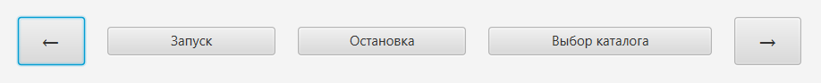
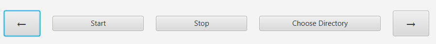

# Image Slider App

Простое JavaFX-приложение для просмотра изображений в виде слайд-шоу.

## Функции
- Автоматический слайд-шоу (интервал 3 секунды)
- Навигация стрелками ← / →
- Выбор папки с изображениями
- Автоматическая локализация (русский / английский) в зависимости от языка системы
- Поддержка форматов JPG и PNG

## Технологии
- Java 17
- JavaFX 21
- Maven

## Скриншоты




## Как запустить
1. Клонируйте репозиторий:
   ```bash
   git clone https://
Откройте проект в IntelliJ IDEA
Запустите класс com.example.Main

ЛокализацияЯзык приложения автоматически определяется по системному языку Windows (язык интерфейса). Для смены языка измените язык интерфейса Windows и перезапустите приложение.


Контакты
Автор: Николай
Email: mailnikolaii@mail.ru
GitHub: https://github.com/eweees
